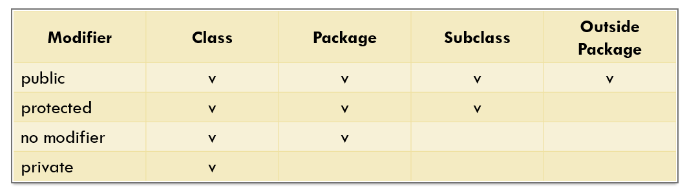

## Ada 4 macam acces level modifier, antara lain :

1.public (+) : dapat diakses dari class mana saja

2.protected(#) : dapat diakses diluar package asal merupakan subclass
(pewarisan terhadap class nya)

3.no modifier(package-private) : hanya dapat diakses di dalam package yang sama

4.private(-) : hanya dapat diakses di dalam class yang sama

class hanya memiliki 2 jenis acces level modifier, yaitu public dan no modifier

